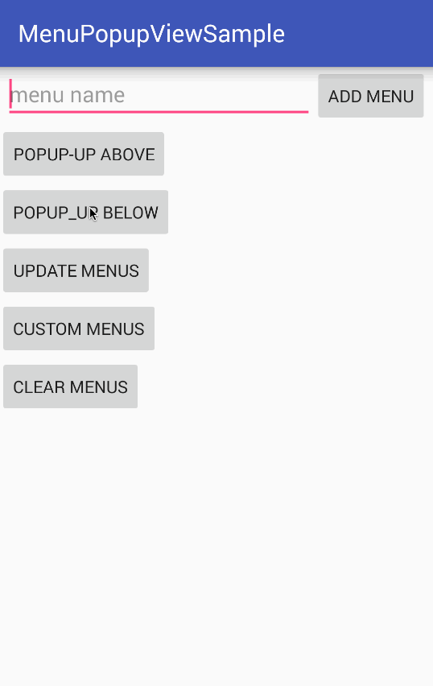

# MenuPopupView
一个仿iOS长按菜单弹窗的自定义控件，基于PopupWindow

## 效果图



## 使用说明

### Gradle

```
// project build.gradle
allprojects {
    repositories {
        jcenter()
        maven {
            url 'https://dl.bintray.com/shamschu/maven'
        }
    }
}

compile 'com.sc.framework.component:menupopupview:1.0.0'
```

### 1. 自定义MenuPopupAdapter
```
public class TestPopupAdapter extends MenuPopupAdapter<String> {

    private List<String> mData;

    public TestPopupAdapter(List<String> data) {
        mData = data;
    }

    // 返回Item View视图对象
    @Override
    public View getView(View container, int position) {
        View view = LayoutInflater.from(container.getContext()).inflate(R.layout.test_item, null);
        TextView tv = (TextView) view.findViewById(R.id.label);
        tv.setText(getItem(position));
        return view;
    }

    /**
     * 获取item数
     *
     * @return item数量
     */
    @Override
    public int getItemCount() {
        return mData.size();
    }

    /**
     * 获取position位置的数据对象
     *
     * @param position 位置索引
     * @return 数据对象
     */
    @Override
    public String getItem(int position) {
        return mData.get(position);
    }

}
```

### 2. 创建PopupView并指定Adapter
```
List<String> menus = new ArrayList<>();
menus.add("default");
menus.add("copy");
MenuPopupAdapter<String> adapter = new TestPopupAdapter(menus);
PopupView popupView = new PopupView(this);
popupView.setAdapter(adapter);
```

### 3. 设置依附anchor方向并显示
```
// 显示在anchor底部
popupView.setPopupLocation(PopupLayout.PopupLocation.Bottom);
// 显示在anchor顶部
popupView.setPopupLocation(PopupLayout.PopupLocation.TOP);
// 显示PopupView
popupView.show(v);
```

### 4. 动态改变菜单并刷新
```
adapter.notifyDataSetChanged();

```

### 5. 设置分割线颜色
```
// 设置item的分割线颜色
popupView.setDriverColorResId(int colorResId);
// 设置左右指示器的分割线颜色
popupView.setIndicatorDriverColorResId(int colorResId);
```
